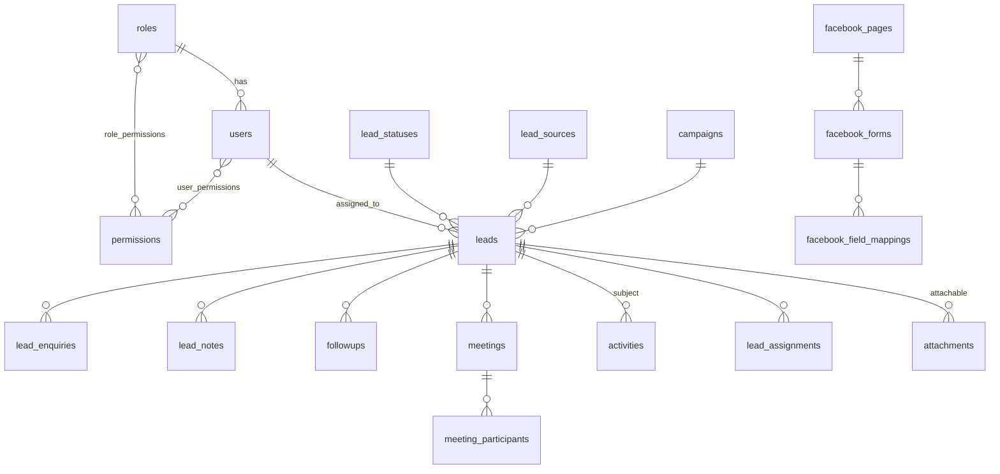
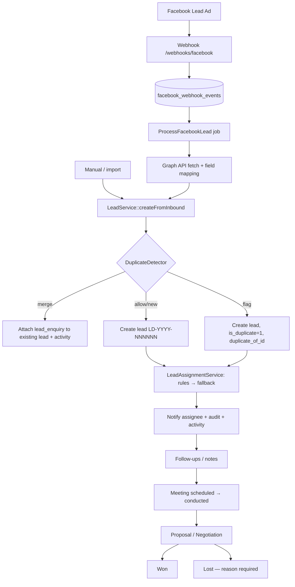

# Sales CRM — Architecture

Status: **Phase 1 (Foundation) and Phase 2 (Lead CRM) implemented.** Phases 3–7 are designed here and will be implemented in order.

Companion documents:

- [DATABASE_SCHEMA.md](DATABASE_SCHEMA.md) — column-level schema for every table
- [PERMISSIONS.md](PERMISSIONS.md) — permission catalogue, role matrix, data scoping rules
- [SECURITY.md](SECURITY.md) — security controls and hardening checklist
- [FACEBOOK_INTEGRATION.md](FACEBOOK_INTEGRATION.md) — Lead Ads webhook and Graph API flow
- [MEETING_MODULE.md](MEETING_MODULE.md) — meetings, calendar, conflicts, reminders (Phase 4)
- [LEAD_MODULE.md](LEAD_MODULE.md) — Phase 2 lead module behaviour (numbering, duplicates, assignment, won/lost, search, files)

---

## 1. Existing project analysis

At the start of this work `c:\wamp64\www\salescrm` contained only an empty git repository (branch `main`, no commits, no files). There was therefore:

- no existing schema or data to migrate or protect,
- no existing modules to remain backward-compatible with,
- no conventions to inherit.

Local environment (WAMP):

| Component | Version | Notes |
|-----------|---------|-------|
| PHP | 8.3.6 (`C:\wamp64\bin\php\php8.3.6`) | CLI default on PATH is 8.1 — **always run artisan/composer with 8.3** |
| MySQL | 8.3.0 | Database `salescrm` (utf8mb4_unicode_ci) |
| Node / npm | 20.18 / 10.9 | Vite build |
| Composer | 2.6.5 | |

Baseline scaffold created:

- Laravel **12.x**
- Laravel Breeze 2 (Vue 3 + Inertia.js + Tailwind CSS + Pest) for the authentication baseline
- Ziggy for named routes in Vue

Public self-registration from Breeze is **removed**: users are only created by administrators.

---

## 2. Proposed architecture

### 2.1 Layering

```
HTTP (routes/web.php, routes/admin.php, routes/webhooks.php)
  └─ Middleware        auth, active user, permission:<name>, throttle, security headers
      └─ Controller    thin: authorize → validate (FormRequest) → call service → Inertia/redirect
          └─ Service   business rules, DB transactions, events, audit
              ├─ Query/visibility scopes   (Lead::visibleTo($user), etc.)
              ├─ Models (Eloquent)         relationships, casts, no business logic
              └─ Events → Listeners        activity timeline, notifications, audit side effects
                    └─ Queue Jobs          Facebook fetch, reminders, notifications
```

Rules:

1. Controllers never contain business rules, never build ad-hoc authorization, never accept `created_by`, `updated_by`, `user_id` from input.
2. All authorization is enforced server-side via **Policies** (per-record) and the **`permission:` middleware** (per-route). The UI hides actions for convenience only.
3. All record listing goes through a **visibility scope** in SQL. The frontend never receives rows it may not see.
4. Every state-changing service method writes an **audit log** entry; business-visible changes also write an **activity** entry.
5. Multi-step writes run in `DB::transaction()`.
6. External systems (Facebook, calendars, WhatsApp) sit behind **interfaces** in `app/Contracts` with implementations in `app/Integrations`.

### 2.2 Directory layout

```
app/
  Contracts/                  CalendarProvider, LeadSourceConnector, MessageChannel
  Enums/                      AuditAction, FollowupStatus, MeetingStatus, NoteVisibility, ...
  Events/ Listeners/          LeadAssigned, LeadStatusChanged, MeetingScheduled, ...
  Exceptions/                 DomainException subclasses (MeetingConflictException, ...)
  Http/
    Controllers/              CRM controllers (Leads, Followups, Meetings, ...)
    Controllers/Admin/        Users, Roles, Settings, AuditLogs, LoginHistory, lookups
    Controllers/Webhooks/     FacebookWebhookController
    Middleware/               EnsurePermission, EnsureUserIsActive, SecurityHeaders
    Requests/                 FormRequests grouped by module
  Integrations/Facebook/      GraphClient, LeadFetcher, FieldMapper
  Jobs/                       ProcessFacebookLead, SendFollowupReminder, ...
  Models/
  Notifications/
  Policies/
  Services/                   AuditService, LeadService, LeadAssignmentService, ...
  Support/                    Permissions catalogue, Navigation, UserAgentParser
resources/js/
  Layouts/AppLayout.vue       sidebar + topbar shell
  Components/ui/              Button, Badge, DataTable, Pagination, Modal, ConfirmDialog, Toast, ...
  Composables/                usePermissions, useToast, useConfirm
  Pages/                      one folder per module
```

### 2.3 Key design decisions

| Decision | Choice | Reason |
|----------|--------|--------|
| RBAC library | **Custom** (tables `roles`, `permissions`, `role_permissions`, `user_permissions`) | Spec defines the tables; custom gives per-user grant/deny overrides and full audit control |
| Role per user | Single `users.role_id` + per-user overrides | Simple mental model for admins, flexible enough via overrides |
| Super Admin | Role flagged `slug = super_admin`; `Gate::before` returns `true` | Cannot be locked out by permission misconfiguration |
| Data scoping | 2 tiers: **own → all**, derived from permissions (`lead.view`, `lead.view_all`). No team tier (see §2.4) | One consistent rule per module, implemented as Eloquent scopes |
| Settings | Key/value `settings` table with typed values, optional encryption, cached | Admin-editable without deploys |
| Audit log | Append-only table; model refuses update/delete | Immutability requirement |
| Activity vs audit | Separate `activities` table (business timeline) and `audit_logs` (security) | Spec §49 |
| Numbering | `number_sequences` table with row lock per (prefix, year) | Gap-free, concurrency-safe `LD-2026-000001` / `MT-2026-000001` |
| Queues | `database` driver locally; Redis recommended for production | No extra infra locally |
| Frontend routing | Inertia + Ziggy | Server-driven pages, no public JSON API needed for the UI |

### 2.4 Access model: Own / All (team visibility removed)

CRM visibility is decided **only** by the lead owner and `*.view_all` permissions:

| Who | Sees |
|-----|------|
| Super Admin / Admin (`*.view_all`) | Everything, including unassigned leads |
| Any other user (`*.view`) | Leads where `leads.assigned_to = me`, plus follow-ups and meetings that are mine or on those leads |
| Unassigned leads | `lead.view_all` holders only |

There is **no team-based fallback**. The rule is permission-driven, not role-name-driven, so a Sales Manager behaves like any OWN user unless a `*.view_all` permission is granted. Reassigning a lead moves access for all nested records immediately. The previous owner sees "You no longer have access to this lead."

**What was removed:**

- Team visibility code paths.
- The Teams admin screens, routes, controller, service, policy and pages. `/admin/teams` returns 404.
- The team report (`/reports/teams` returns 404).
- Team filters, options and aggregates in lists, reports and dashboards.
- The Team and Manager fields on the user form.
- Team selection on assignment rules.

**What is deprecated but kept (no data dropped, no destructive migration):**

| Item | Status |
|------|--------|
| `teams`, `team_users` tables | Kept, read by nothing in authorization |
| `users.team_id`, `users.manager_id` | Kept. Hidden from the user form and ignored if posted |
| `leads.team_id`, `followups.team_id`, `meetings.team_id`, `lead_status_changes.team_id` | Kept for history. **No longer written** on new records and never used for authorization or reporting scope |
| `lead_assignments.from_team_id` / `to_team_id` | Kept for history, not used |
| `lead.view_team`, `followup.view_team`, `meeting.view_team`, `report.view_team`, `team.view`, `team.manage` | `Permissions::DEPRECATED`. Stripped from resolved permissions, not seeded, relabelled "(deprecated, no effect)" by `2026_09_24_800001_deprecate_team_permissions`. (`call.view_team` was deleted with the telephony module, §12.) |
| Assignment rules with assignment `team` / `team_round_robin` or condition `team` | Kept for history, flagged "Deprecated — not running". The engine skips them (`LeadAssignmentRule::isDeprecated()`). They can't be enabled, and new ones can't be created |

Dropping these columns and tables requires explicit approval and a separate, reviewed migration.

Release-blocking coverage lives in `tests/Feature/AccessModel/AccessModelTest.php`:

- sales-user isolation across every module;
- unassigned leads are admin-only;
- reassignment moves access;
- legacy `team_id` and legacy managers grant nothing;
- legacy team permissions have no effect;
- no team filters or aggregates;
- team rules never run.

---

## 3. Database schema (summary)

Full column definitions: [DATABASE_SCHEMA.md](DATABASE_SCHEMA.md).

### 3.1 Tables to create

| Phase | Table | Purpose |
|-------|-------|---------|
| 1 | `roles` | Role definitions (system + custom) |
| 1 | `permissions` | Permission catalogue (seeded from code) |
| 1 | `role_permissions` | Role ↔ permission |
| 1 | `user_permissions` | Per-user grant/deny override |
| 1 | `teams` | **Deprecated** (kept, unused; see §2.4) |
| 1 | `team_users` | **Deprecated** (kept, unused; see §2.4) |
| 1 | `settings` | Typed key/value system settings |
| 1 | `audit_logs` | Immutable security/admin audit trail |
| 1 | `login_histories` | Login / logout / failed attempts |
| 1 | `notifications` | Laravel database notifications |
| 2 | `number_sequences` | Human-readable number generator |
| 2 | `lead_statuses`, `lead_sources`, `lost_reasons` | Configurable lookups |
| 2 | `campaigns` | Marketing campaigns (manual or Facebook) — needed by `leads.campaign_id` |
| 2 | `leads` | Core lead record |
| 2 | `lead_enquiries` | Every inbound enquiry (incl. duplicates merged into an existing lead) |
| 2 | `lead_custom_fields`, `lead_custom_field_values` | Admin-defined fields |
| 2 | `lead_assignments` | Assignment history |
| 2 | `lead_assignment_rules` | Auto-assignment rules |
| 2 | `lead_notes`, `lead_note_histories` | Notes with edit history |
| 2 | `activities` | Business-friendly timeline |
| 2 | `attachments` | Private files (polymorphic) |
| 3 | `followup_types`, `followups` | Follow-up engine |
| 3 | `followup_reminders` | Follow-up reminder queue rows |
| 4 | `meeting_types`, `meetings`, `meeting_participants`, `meeting_reminders` | Meeting module |
| 5 | `facebook_integrations`, `facebook_pages`, `facebook_forms`, `facebook_field_mappings`, `facebook_webhook_events` | Facebook Lead Ads |

### 3.2 Tables to modify

| Table | Change | Migration |
|-------|--------|-----------|
| `users` (Breeze) | add `employee_code`, `phone`, `role_id`, `team_id`, `manager_id`, `designation`, `is_active`, `last_login_at`, `last_login_ip`, `deleted_at` | `2026_09_24_000001_add_crm_columns_to_users_table` — additive only, no columns dropped |

`users.team_id` and `users.manager_id` are deprecated (§2.4): kept in the database, hidden from the UI and never used for access. Departments are not modelled; a `departments` table can be added later without breaking changes.

### 3.3 Entity relationships (core)



---

## 4. RBAC matrix

Full catalogue and override rules: [PERMISSIONS.md](PERMISSIONS.md). Default seeded roles (Super Admin bypasses all checks):

| Permission group | Admin | Sales Manager | Sales Executive |
|------------------|:-----:|:-------------:|:---------------:|
| `lead.view` (own) | ✔ | ✔ | ✔ |
| `lead.view_all` (incl. unassigned) | ✔ | | |
| `lead.create` / `lead.edit` | ✔ | ✔ (own) | ✔ (own) |
| `lead.change_status` | ✔ | ✔ (own) | ✔ (own) |
| `lead.assign` / `lead.reassign` | ✔ | ✔ (own leads) | |
| `lead.bulk_action` | ✔ | | |
| `lead.delete` / `lead.restore` | ✔ / | | |
| `lead.import` / `lead.export` | ✔ | | |
| `lead.edit_source` | ✔ | ✔ | |
| `lead.configure` / `lead.assignment_rules` | ✔ | | |
| `note.view_private` | ✔ | | |
| `followup.view` / `create` / `edit` / `complete` / `cancel` | ✔ | ✔ (own) | ✔ (own) |
| `followup.view_all` | ✔ | | |
| `followup.assign` | ✔ | ✔ (own leads) | |
| `followup.delete` (soft delete / restore) | ✔ | ✔ | |
| `followup.schedule_past` / `followup.configure` | ✔ | | |
| `meeting.view` / `create` / `edit` / `cancel` / `complete` | ✔ | ✔ (own) | ✔ (own) |
| `meeting.view_all` | ✔ | | |
| `meeting.assign` / `meeting.create_without_lead` | ✔ | ✔ (own leads) | |
| `meeting.override_conflict` | ✔ | ✔ | |
| `meeting.delete` (soft delete / restore) | ✔ | | |
| `meeting.schedule_past` / `meeting.configure` | ✔ | | |
| `note.edit_any` / `note.delete` | ✔ | ✔ | |
| `user.*`, `role.*` | ✔ (except `role.manage`, `user.delete`) | `user.view` | |
| `report.view` / `report.view_all` / `report.export` | ✔ | `report.view` (own) | `report.view` (own) |
| `audit.view`, `login_history.view` | ✔ | | |
| `settings.view` / `settings.manage` | ✔ | | |
| `facebook.manage` | | | |
| `file.view` / `file.upload` / `file.download` | ✔ | ✔ | `file.view`, `file.upload` |

Admin does **not** receive `role.manage`, `facebook.manage`, `lead.restore`, `user.delete` or `audit` immutability overrides by default — Super Admin grants them explicitly.

The Sales Manager role has **no** `*.view_all` and no team tier. Its extras apply only to records it can see, which by default are its own. The deprecated `*.view_team`, `team.view` and `team.manage` permissions are not in this matrix because they have no effect (§2.4).

---

## 5. Module structure

| Module | Backend | Frontend pages |
|--------|---------|----------------|
| Auth | Breeze controllers + `LoginHistoryService` listeners | `Auth/Login`, password reset |
| Users | `Admin\UserController`, `UserService`, `UserPolicy` | `Admin/Users/Index`, `Form` |
| Roles & Permissions | `Admin\RoleController`, `RoleService`, `PermissionRegistrar` | `Admin/Roles/Index`, `Edit` (matrix) |
| Settings | `Admin\SettingController`, `SettingService` | `Admin/Settings/Index` (tabbed) |
| Audit | `AuditService`, `Admin\AuditLogController` | `Admin/AuditLogs/Index`, `Show` |
| Login History | `Admin\LoginHistoryController` | `Admin/LoginHistory/Index` |
| Leads | `Leads\LeadController`, `LeadService`, `LeadQueryService`, `LeadNumberService`, `LeadDuplicateService`, `PhoneNormalizer`, `LeadVisibility`, `LeadPolicy` | `Leads/Index`, `Show` (360°), `Form` |
| Lead lookups | `Admin\LeadSettingsController`, `LeadConfigurationService` | `Admin/LeadSettings/Index` (statuses, sources, lost reasons, campaigns) |
| Assignment | `LeadAssignmentService`, `LeadAssignmentEngine`, `AssignmentRuleService`, `Admin\AssignmentRuleController` | `Admin/AssignmentRules/Index`, assign modal on `Leads/Show` |
| Pipeline | `Leads\LeadPipelineController` (uses `LeadService::changeStatus`) | `Leads/Pipeline` (kanban) |
| Notes | `Leads\LeadNoteController`, `LeadNoteService`, `LeadNotePolicy` | tab inside `Leads/Show` |
| Custom fields | `Admin\CustomFieldController`, `LeadCustomFieldService` | `Admin/CustomFields/Index` |
| Activity timeline | `App\Services\ActivityService` (separate from audit) | tab inside `Leads/Show` |
| Follow-ups | `Followups\FollowupController` (+ `FollowupCompletionController`, `FollowupRescheduleController`, `FollowupCancellationController`), `FollowupService`, `FollowupQueryService`, `FollowupVisibility`, `LeadFollowupSyncService`, `FollowupMetrics`, `FollowupPolicy`, `FollowupPresenter` | `Followups/Index` (Due/Today/Overdue/Upcoming/Completed/Cancelled/All), `Followups/Show`, Follow-ups tab on `Leads/Show`, dashboard widgets |
| Follow-up reminders | `followups:dispatch-reminders` command, `FollowupReminderService`, `SendFollowupReminder` job, `FollowupNotificationService` | bell + `Notifications/Index` |
| Follow-up settings | `Admin\FollowupSettingsController`, `FollowupTypeService` | `Admin/FollowupSettings/Index` |
| Meetings | `Meetings\MeetingController` (+ `MeetingStatusController`, `MeetingCompletionController`, `MeetingRescheduleController`, `MeetingCancellationController`, `MeetingParticipantController`), `MeetingService`, `MeetingCompletionService`, `MeetingQueryService`, `MeetingVisibility`, `MeetingConflictService`, `MeetingParticipantService`, `MeetingMetrics`, `MeetingPolicy`, `MeetingPresenter` | `Meetings/Index`, `Meetings/Show`, form / reschedule / cancel / complete / no-show modals, Meetings tab on `Leads/Show`, dashboard widgets |
| Calendar | `Meetings\MeetingCalendarController` (range-loaded JSON feed, visibility-scoped) | `Calendar/Index` (FullCalendar) |
| Meeting reminders | `meetings:dispatch-reminders` command, `MeetingReminderService` + shared `Reminders\ReminderQueue`, `SendMeetingReminder` job, `MeetingNotificationService` | bell + `Notifications/Index` |
| Meeting settings | `Admin\MeetingSettingsController`, `MeetingTypeService` | `Admin/MeetingSettings/Index` |
| Facebook | `FacebookWebhookController`, `ProcessFacebookLeadJob`, `FacebookLeadService`, `Integrations\Facebook\*` | `Integrations/Facebook/*` |
| Reports | `Reports\ReportController`, `ReportExportController`, `ReportService`, `ReportScope`, `ReportFilters`, `ReportQueries`, `Reports\Metrics\*`, `Reports\Definitions\*Report`, `ReportExportService`, `GenerateReportExport` job, `reports:prune-exports` | `Reports/Index`, `Reports/Show`, `Components/reports/*`, dashboard KPI strip — see [REPORTING_MODULE.md](REPORTING_MODULE.md) |
| Notifications | Laravel notifications + `NotificationController` | bell dropdown + `Notifications/Index` |
| Search | `Leads\LeadSearchController` (visibility-scoped) | `GlobalLeadSearch` topbar autocomplete |
| Files | `Leads\LeadAttachmentController`, `LeadAttachmentService` (streams from private disk) | tab inside `Leads/Show` |

---

## 6. Lead lifecycle



Status transitions go through `LeadService::changeStatus()` which:

1. authorizes (`lead.change_status` + policy on the lead),
2. requires `lost_reason_id` when target status `is_lost`,
3. sets `converted_at` / `lost_at`,
4. writes activity (`New → Contacted`) and audit (`LEAD_STATUS_CHANGED`, old/new),
5. fires `LeadStatusChanged` (notifications, pipeline refresh).

---

## 7. Facebook integration flow

Detail: [FACEBOOK_INTEGRATION.md](FACEBOOK_INTEGRATION.md).

1. `GET /webhooks/meta/leads`: hub challenge verification against `META_WEBHOOK_VERIFY_TOKEN` (`.env` only, `hash_equals`). Returns the raw challenge, otherwise 403.
2. `POST /webhooks/meta/leads` (outside the `web` group, so no session or CSRF):
   - validates `X-Hub-Signature-256` as HMAC-SHA256 of the **raw body** with `META_APP_SECRET`, in constant time;
   - records each `leadgen` change in `facebook_webhook_events`, where the unique `leadgen_id` is the idempotency ledger;
   - dispatches `ProcessMetaLeadEvent` on the `integrations` queue;
   - returns `200 EVENT_RECEIVED` without any Graph call.
3. `MetaLeadIngestionService` claims the event and fetches `/{leadgen_id}` through `MetaGraphClient` (Bearer header plus `appsecret_proof`, outside any transaction). It then maps fields (`MetaFieldMappingService`, allow-list only) and upserts the campaign. In **one transaction** it checks for duplicates by `leadgen_id` and calls `LeadService::createFromInbound()`, which covers the duplicate policy, enquiry, assignment engine, activity and audit. The notification is sent after commit.
4. Failures are categorised (`MetaApiException`). Retryable ones back off (60 s, 5 min, 15 min, 1 h). The rest, or events that exhaust their attempts, are dead-lettered as `failed` and shown on Admin → Integrations → Facebook → Webhook events with a Retry action. Nothing is silently discarded.

Services (`App\Services\Meta`): `MetaGraphClient`, `MetaOAuthService`, `MetaIntegrationService`, `MetaPageService`, `MetaFormService`, `MetaFieldMappingService`, `MetaCampaignService`, `MetaLeadService`, `MetaWebhookService`, `MetaLeadIngestionService`; redaction in `App\Support\SecretRedactor` and `App\Logging\RedactSecrets`.

---

## 8. Meeting workflow

Detail: [MEETING_MODULE.md](MEETING_MODULE.md).

`scheduled → confirmed → in_progress → completed` with side exits `cancelled`, `no_show`, `rescheduled` (reschedule keeps the original as history and creates a new meeting linked by `rescheduled_from_id`). Meeting visibility is its own tier AND lead visibility. Completion requires an outcome and (if configured) notes, and can create the next follow-up through `FollowupService` and change the lead status through `LeadService` in the same transaction. Conflict detection covers the host and internal participants (`start_at < new_end AND end_at > new_start`, excluding cancelled / rescheduled and declined participants); details are shown only when the actor can see the clashing meeting; override requires `meeting.override_conflict` and is audited. Reminders are per-attendee rows claimed atomically by `meetings:dispatch-reminders`. No external calendar sync, meeting-link generation or export in Phase 4.

---

## 9. Audit architecture

- **`AuditService::log(action, module, subject, description, old, new)`** — single entry point. Captures user, IP, user agent, route name, HTTP method automatically from the current request (or `system`/`console` when run from jobs).
- **Sanitisation**: keys matching `password`, `token`, `secret`, `remember_token`, `api_key`, `access_token`, `app_secret`, `verify_token`, `authorization` are replaced with `[REDACTED]` recursively before storage.
- **Diffs**: `AuditService::diff($model)` returns only changed attributes (old vs new) using Eloquent dirty tracking.
- **Immutability**: `AuditLog` model throws on `update`/`delete`; no update/delete routes exist; no permission grants edit. (DB-level: production DB user can be restricted to `INSERT, SELECT` on `audit_logs`.)
- **Actions** are an enum (`App\Enums\AuditAction`) so they are consistent and searchable.
- **Auth events**: listeners on `Login`, `Logout`, `Failed`, `Lockout` write both `login_histories` and `audit_logs`.
- **Views**: `LEAD_VIEWED` is recorded on the lead detail page (deduplicated per user/lead per 30 minutes; Inertia partial reloads are not counted).
- **Activity timeline** is separate (`activities`) and human-readable.

---

## 10. Security architecture

Detail: [SECURITY.md](SECURITY.md). Highlights:

- Session auth, CSRF on all web routes (webhook excluded but HMAC-verified), encrypted sessions, regenerate on login.
- Login throttling (5 attempts / email+IP) + global `throttle` on sensitive routes; failed logins logged.
- Inactive users are logged out on next request (`EnsureUserIsActive`) and cannot log in.
- Route-level `permission:` middleware + Policies + SQL visibility scopes (defence in depth).
- FormRequests whitelist fields; models use explicit `$fillable`; ownership fields (`created_by`, `assigned_to` for sales users) are set by services, never from input.
- Secrets (Facebook tokens, app secret) stored with Laravel `encrypted` casts; never serialised to the frontend (`$hidden`) and never audited.
- Files on the private `local` disk, streamed only via authorized controller (`file.download` + lead access), audited as `FILE_DOWNLOADED`.
- Export endpoints exist only behind `permission:lead.export` / `report.export`; denied attempts are audited as `EXPORT_ATTEMPTED`.
- Security headers middleware (X-Frame-Options, X-Content-Type-Options, Referrer-Policy, Permissions-Policy).

---

## 11. Route structure

All CRM routes are `auth` + `active` protected. Route files: `routes/web.php` (CRM), `routes/admin.php` (prefix `/admin`), `routes/webhooks.php` (no session/CSRF).

```
GET    /                                   → redirect to /dashboard
GET    /dashboard                          DashboardController
GET    /search?q=                          SearchController            (scoped)
GET    /notifications                      NotificationController@index (own only, access re-checked)
GET    /notifications/recent               bell JSON (unread + last 8)
POST   /notifications/{uuid}/read | /notifications/read-all
GET    /notifications/{uuid}/open          mark read + redirect (stale → notification center)

# Leads (Phase 2 — implemented, routes/leads.php)
# group: permission:lead.view|lead.view_all ; {lead}/{note}/{attachment} are numeric-only
GET    /leads                              index (paginated, filtered + sorted in SQL)
GET    /leads/create | POST /leads         lead.create
POST   /leads/duplicate-check              live duplicate warning (visible matches only)
GET    /leads/pipeline                     kanban (25 cards/column)
GET    /leads/pipeline/{status}/more       next page of a column
GET    /leads/{lead}                       360° page (withTrashed; archived needs lead.delete|lead.restore)
GET    /leads/{lead}/activities?before=    timeline cursor pagination
GET    /leads/{lead}/edit | PUT /leads/{lead}   lead.edit
POST   /leads/{lead}/priority              lead.edit
DELETE /leads/{lead}                       archive (lead.delete)
POST   /leads/{lead}/restore               lead.restore
POST   /leads/{lead}/assign                lead.assign | lead.reassign
POST   /leads/{lead}/status                lead.change_status
POST   /leads/{lead}/notes | PUT/DELETE /leads/{lead}/notes/{note} | GET …/{note}/history
POST   /leads/{lead}/attachments           file.upload
GET    /leads/{lead}/attachments/{attachment}/download   file.download + throttle:sensitive
DELETE /leads/{lead}/attachments/{attachment}
GET    /search/leads?q=                    topbar search (8 results, scoped)
# Not built yet: bulk actions, import, export (Phase 6). No export route exists.

# Follow-ups (Phase 3 — implemented, routes/followups.php)
# group: permission:followup.view|followup.view_all ; {followup} numeric-only
GET    /follow-ups?tab=due|today|overdue|upcoming|completed|cancelled|all&search&scope&assigned_to&type&priority&lead&from&to
POST   /follow-ups                         followup.create (lead_id in body; policy checks lead access)
GET    /follow-ups/{followup}              detail (withTrashed; deleted needs followup.delete)
PUT    /follow-ups/{followup}              followup.edit (pending only)
DELETE /follow-ups/{followup}              followup.delete (soft) | POST /follow-ups/{followup}/restore
POST   /follow-ups/{followup}/complete     followup.complete
POST   /follow-ups/{followup}/reschedule   followup.edit
POST   /follow-ups/{followup}/cancel       followup.cancel
# No bulk, export or download route.

# Meetings (Phase 4 — implemented, routes/meetings.php)
# group: permission:meeting.view|meeting.view_all ; {meeting}/{participant} numeric-only
GET    /meetings?tab=upcoming|today|past|completed|cancelled|no_show|all&search&scope&host&type&status&priority&location_type&lead&from&to
POST   /meetings                           meeting.create (lead_id in body; none → meeting.create_without_lead)
GET    /meetings/participants/search?q&lead_id   meeting.create, throttle:search (invitable users only)
GET    /meetings/{meeting}                 detail (withTrashed; deleted needs meeting.delete)
PUT    /meetings/{meeting}                 meeting.edit (upcoming only; schedule via reschedule)
DELETE /meetings/{meeting} | POST /meetings/{meeting}/restore   meeting.delete
POST   /meetings/{meeting}/confirm | reschedule          meeting.edit
POST   /meetings/{meeting}/start | complete | no-show    meeting.complete
POST   /meetings/{meeting}/cancel                        meeting.cancel
POST   /meetings/{meeting}/participants | DELETE …/participants/{participant}   meeting.edit
POST   /meetings/{meeting}/respond         own RSVP (internal participant)
GET    /calendar | /calendar/events?start&end&scope=mine&host&type&hide_cancelled   (≤ 62 days, ≤ 1000 events)
# No meeting export, .ics or download route.

# Calls & telephony — removed (Phase 6, §12). None of its pages, admin screens or provider
# webhooks are registered any more; old URLs return 404.

# Reports (Phase 7 — implemented, routes/reports.php)
# group: permission:report.view|report.view_all ; scope via ReportScope; {report} whitelisted slug ([a-z-]+), unknown → 404
GET    /reports                            report centre
GET    /reports/{report}                   report page (filters in query string); the removed teams slug → 404 for everyone
POST   /reports/{report}/export            report.export (403 + EXPORT_ATTEMPTED otherwise), throttle:10,1 — section + filters
GET    /reports/report-exports/{uuid}      owner only, report.export, not expired; Cache-Control: no-store
# No report API/JSON endpoint, no scheduled email, no public export URL.

# Branding & browser notifications (Phase 7.1, routes/web.php)
GET    /branding/{logo|favicon}            public (login page), throttle:120,1, ?v= content hash → immutable cache
PUT    /profile/notifications              own browser / sound preferences (audited)
POST   /push-subscriptions                 register this browser for the session user (throttle:sensitive, allow-listed HTTPS endpoint)
DELETE /push-subscriptions                 remove own subscription for this endpoint

# Admin (/admin)
resource users (no destroy → deactivate), POST users/{user}/reset-password, users/{user}/toggle-active
resource roles, PUT roles/{role}/permissions
(teams routes removed: /admin/teams* → 404, see §2.4)
GET/PUT settings/{group}
POST/DELETE branding/{logo|favicon}                                                                 (settings.manage, throttle:sensitive)
GET audit-logs, audit-logs/{auditLog}
GET login-history
GET/POST/PUT/DELETE lead-settings/{statuses|sources|lost-reasons|campaigns}[/{id}], POST …/reorder   (lead.configure)
GET/POST/PUT/DELETE custom-fields[/{customField}], POST custom-fields/reorder                       (lead.configure)
GET/POST/PUT/DELETE assignment-rules[/{rule}], POST …/{rule}/toggle, POST …/reorder                 (lead.assignment_rules)
GET followup-settings, PUT followup-settings/settings, POST followup-settings/types[/reorder],
    PUT/DELETE followup-settings/types/{followupType}                                               (followup.configure)
GET meeting-settings, PUT meeting-settings/settings, POST meeting-settings/types[/reorder],
    PUT/DELETE meeting-settings/types/{meetingType}                                                 (meeting.configure)

# Integrations (Phase 5 — implemented, /admin/integrations/facebook, permission:facebook.manage)
GET  /                                    overview (health, Pages, forms, failures, settings)
GET  connect, callback                    OAuth (callback also validates single-use state)
POST manual-token                         META_ALLOW_MANUAL_TOKEN + Super Admin only
POST test, disconnect, pages/refresh, forms/refresh      throttle:sensitive
PUT  pages/{facebookPage}, settings, forms/{facebookForm}
GET/PUT forms/{facebookForm}/mapping
POST forms/{facebookForm}/sync-leads      queued backfill (1–90 days)
GET  events, POST events/{facebookEvent}/retry
# Webhooks (routes/webhooks.php — no web group, no session/CSRF)
GET  /webhooks/meta/leads                 verify token → raw challenge | 403
POST /webhooks/meta/leads                 throttle:meta-webhook, raw-body HMAC-SHA256, 2 MB cap
```

---

## 12. Implementation phases

| Phase | Scope | Status |
|-------|-------|--------|
| 0 | Scaffold Laravel 12 + Breeze Vue/Inertia, MySQL, docs | ✅ Done |
| 1 | Auth hardening, users, roles, permissions, teams, settings, base UI/sidebar, audit framework, login history | ✅ Done |
| 2 | Leads, statuses, sources, campaigns, lead numbers, assignment + rules, lead 360° page, activity timeline, notes, custom fields, duplicate detection, attachments, pipeline | ✅ Done |
| 3 | Follow-ups, reminders (scheduler + queue), derived overdue, notification center, dashboard widgets | ✅ Done |
| 4 | Meetings, types, participants, calendar, conflict detection, reminders, outcomes, rescheduling | ✅ Done |
| 5 | Facebook config, webhook, Graph fetch, form mapping, campaign metadata, auto assignment, webhook logs | ✅ Done |
| 6 | Telephony — Removed. The calling module (click-to-call, browser calling, call history, dispositions, recordings) was built and later removed completely; see "Phase 6 — Telephony — Removed" below | ❌ Removed |
| 7 | Reporting & analytics: report centre (13 reports), dashboard KPIs, performance, pipeline, funnel, ageing/neglect, response time, follow-ups/meetings, campaigns/Meta, private expiring exports | ✅ Done |
| 7.1 | UI cleanup (lead value hidden behind a flag, data kept), company logo / favicon branding, opt-in browser push notifications (Web Push + VAPID) and notification sounds | ✅ Done |
| 8 | Production readiness: production guards, `app:production-check`, `crm:create-super-admin`, CSP/headers, `/health`, error pages, deployment/operations/UAT docs, release 1.0.0 | ✅ Done (external go-live checks pending) |
| AM | Access model change: team-based visibility removed (Own / All only), Teams UI/routes removed, team columns/tables/permissions deprecated (kept), team rules inert — see §2.4 | ✅ Done |
| — | Security hardening test suite (URL manipulation, mass assignment, exports, files, webhook, rate limits) | Planned (tests added incrementally every phase) |

### Phase 1 deliverables (implemented)

- Migrations: users CRM columns, roles, permissions, role_permissions, user_permissions, teams, team_users, settings, audit_logs, login_histories, notifications.
- Permission catalogue in code (`App\Support\Permissions`) synced to DB by seeder; `PermissionRegistrar` caches effective permissions per user.
- `permission:` middleware, `active` middleware, `SecurityHeaders` middleware, `Gate::before` for Super Admin, policies for User/Role/Team.
- Services: `AuditService`, `UserService`, `RoleService`, `TeamService`, `SettingService`, `LoginHistoryService`.
- Auth: registration disabled, inactive users blocked, login/logout/failed logging, `last_login_at`.
- UI: `AppLayout` with permission-driven sidebar (navigation built server-side), topbar, toasts, confirm dialog, data table, pagination, badges; admin pages for Users, Roles (permission matrix), Teams, Settings (tabbed), Audit Logs, Login History.
- Seeders: permissions, 4 default roles, default settings, Super Admin account.
- Tests: authentication, RBAC route protection, user management, role permission changes, audit sanitisation & immutability, login history.

### Phase 2 deliverables (implemented)

Behaviour details: [LEAD_MODULE.md](LEAD_MODULE.md).

- Migrations: lookup tables + `number_sequences`, `leads` + `lead_assignment_rules`, enquiries / assignments / custom fields / notes / note histories / activities / attachments.
- Services (`App\Services\Leads`): `LeadVisibility` (single visibility source, scoped binding), `LeadService`, `LeadQueryService`, `LeadNumberService`, `PhoneNormalizer`, `LeadDuplicateService`, `LeadAssignmentService`, `LeadAssignmentEngine`, `AssignmentRuleService`, `LeadCustomFieldService`, `LeadNoteService`, `LeadAttachmentService`, `LeadConfigurationService`, `LeadOptions`; plus `App\Services\ActivityService`.
- Events (no listeners yet, consumed from Phase 3): `LeadCreated`, `LeadAssigned`, `LeadStatusChanged`.
- Policies: `LeadPolicy`, `LeadNotePolicy`. Presenter: `App\Http\Presenters\LeadPresenter` controls exactly which fields reach the browser.
- UI: lead list (filters, advanced filters, sort, per-page), create/edit form with live duplicate warning, 360° page (Overview / Activity / Notes / Enquiries / Attachments, Follow-ups & Meetings placeholders), kanban pipeline with drag & drop and lost-reason modal, topbar search, admin Lead Settings / Custom Fields / Assignment Rules.
- Seeders: `LeadReferenceSeeder` (statuses, sources, lost reasons — always), `LeadDemoSeeder` (26 demo leads through the real services — local only).
- Tests: 19 files in `tests/Feature/Leads` (140 tests) including the release-blocking `LeadIsolationSecurityTest`.

Design decisions taken in Phase 2:

| Decision | Choice |
|----------|--------|
| Visibility | One class (`LeadVisibility`) with mirrored SQL/PHP rules, used by every lead query and policy |
| Won/Lost columns | Represent the current state only; reopen clears them, history stays in activities + audit |
| Duplicate warnings | Only matches the user can already see; hidden leads are never revealed, not even as a count |
| Manual create + `merge` mode | Behaves like `flag` (a user explicitly creating a lead gets a new lead); merge applies to inbound channels |
| Archived leads | Excluded from duplicate matching and pipeline; visible via the "Archived" filter to `lead.delete`/`lead.restore` holders |
| Pipeline | One bounded query per active status (≤ 25 cards) + one grouped count; "load more" per column |
| Timeline | Cursor pagination on `activities.id` (20 per page) |
| Phone search | ≥ 10 digits → exact normalized match (indexed); 4–9 digits → suffix `LIKE` (not indexed, acceptable at CRM scale) |

### Phase 3 deliverables (implemented)

Behaviour details: [FOLLOWUP_MODULE.md](FOLLOWUP_MODULE.md).

- Migration: `followup_types`, `followups`, `followup_reminders` (additive; Phase 1/2 schema untouched).
- Enums/support: `FollowupStatus` (pending, completed, cancelled, rescheduled), `FollowupOutcome`, `FollowupReminderOptions`, `CrmTime` (CRM timezone ↔ UTC), new audit actions (`FOLLOWUP_CANCELLED/DELETED/RESTORED/REMINDER_SENT/ACCESS_DENIED`).
- Services (`App\Services\Followups`): `FollowupVisibility`, `FollowupService`, `FollowupQueryService`, `LeadFollowupSyncService`, `FollowupReminderService`, `FollowupNotificationService`, `FollowupMetrics`, `FollowupOptions`, `FollowupTypeService`.
- Scheduler: `followups:dispatch-reminders` every minute (`withoutOverlapping`) → queued `SendFollowupReminder` job → database notification.
- Notifications: reminder, overdue, assigned, rescheduled; `NotificationController` + topbar bell + notification center.
- UI: follow-up list (tabs with counts, filters, desktop table + mobile cards), detail page, create/edit/complete/reschedule/cancel modals, Lead 360 Follow-ups tab + quick action + next follow-up date, sales dashboard widgets, admin Follow-up Settings.
- Seeders: `FollowupReferenceSeeder` (types — always), `FollowupDemoSeeder` (local demo data through the real services).
- Tests: `tests/Feature/Followups` (15 files, 109 tests) including the release-blocking `FollowupIsolationSecurityTest` and reminder idempotency; `tests/Feature/Security/RoleDefaultsPreflightTest.php`.

Design decisions taken in Phase 3:

| Decision | Choice |
|----------|--------|
| Overdue | Derived at read time (`pending AND scheduled_at < now()`); never stored; `followup.mark_missed_after_minutes` removed |
| Visibility | Follow-up tier AND lead visibility, always; archived leads hide their follow-ups |
| Reschedule | Original kept as `rescheduled` history; new pending record linked by `rescheduled_from_id` |
| `next_followup_at` | Earliest pending follow-up, including overdue ones (null when none) |
| Reminder idempotency | One row per alert; atomic `pending → processing` claim; job re-validates access before sending |
| Lead status on completion | Never automatic; optional explicit change through `LeadService` with `lead.change_status` |
| Priority | Reuses `LeadPriority` — one definition across modules |
| Delete vs cancel | Cancel (reason, kept) for normal work; soft delete only for management clean-up |

### Phase 4 deliverables (implemented)

Behaviour details: [MEETING_MODULE.md](MEETING_MODULE.md).

- Migration: `meeting_types`, `meetings`, `meeting_participants`, `meeting_reminders` (additive; Phase 1–3 schema untouched).
- Enums/support: `MeetingStatus`, `MeetingOutcome`, `MeetingLocationType`, `MeetingLocationMode`, `MeetingParticipantType`, `AttendanceStatus`, `MeetingReminderOptions`, `ReminderState`; 13 new meeting audit actions; 5 new permissions.
- Shared infrastructure: `NumberSequenceService` (lead + meeting numbers), `Reminders\ReminderQueue` (atomic claim / sent / release for follow-up and meeting reminders — `FollowupReminderService` now delegates to it; behaviour unchanged).
- Services (`App\Services\Meetings`): `MeetingVisibility`, `MeetingService`, `MeetingCompletionService`, `MeetingConflictService`, `MeetingParticipantService`, `MeetingReminderService`, `MeetingNotificationService`, `MeetingQueryService`, `MeetingMetrics`, `MeetingOptions`, `MeetingNumberService`, `MeetingTypeService`.
- Scheduler: `meetings:dispatch-reminders` every minute (`withoutOverlapping`) → queued `SendMeetingReminder` job → database notification.
- UI: meeting list (tabs, filters, table + mobile cards), detail page (actions, RSVP, participants, outcome, reschedule history), schedule / reschedule / cancel / complete / no-show modals, FullCalendar calendar (month / week / day / agenda, click-to-schedule, drag-to-reschedule), Lead 360 Meetings tab + quick action, dashboard meeting widgets, admin Meeting Settings.
- Seeders: `MeetingReferenceSeeder` (10 types — always), `MeetingDemoSeeder` (local demo meetings through the real services).
- Tests: `tests/Feature/Meetings` (18 files) including release-blocking isolation, conflict, conflict privacy and reminder idempotency suites, and N+1 guards.

Design decisions taken in Phase 4:

| Decision | Choice |
|----------|--------|
| Visibility | Meeting tier AND lead visibility; participation never grants lead access |
| Manage vs view | Hosts / view_all users manage; other participants view and RSVP only |
| Conflicts | Host + internal participants; cancelled / rescheduled don't block, completed / no-show do; declined participants are free |
| Conflict privacy | Details only for meetings the actor can view; otherwise "unavailable during the selected time" |
| Reschedule | Original kept as `rescheduled`; new meeting linked by `rescheduled_from_id`; participants copied |
| Edit scope | Edit never moves the time (reschedule does) or changes participants (dedicated endpoints) |
| Reminders | `meeting_reminders` rows per offset × attendee via the shared `ReminderQueue` (replaces the design doc's `reminder_sent_at`) |
| Follow-up / status on completion | Only through `FollowupService` / `LeadService`; outcome never changes status on its own |
| Permissions | `meeting.reschedule` / `meeting.restore` not added — covered by `meeting.edit` / `meeting.delete` |
| Calendar time zone | Feed in CRM wall-clock time, FullCalendar in UTC-coercion mode (no timezone plugin) |

### Phase 5 deliverables (implemented)

Behaviour details: [FACEBOOK_INTEGRATION.md](FACEBOOK_INTEGRATION.md).

- **Migration:** `facebook_integrations`, `facebook_pages`, `facebook_forms`, `facebook_field_mappings`, `facebook_webhook_events`, plus `lead_enquiries.channel` / `metadata_json` / unique(channel, external_id) and lead indexes. It is additive only.
- **Config and enums:** `config/meta.php` (Graph version, scopes, queue, timeouts, backoff and size limits all come from env/config), `FacebookIntegrationStatus`, `FacebookEventStatus`, `MetaErrorCategory`, 16 audit actions and 5 `facebook.*` settings.
- **Services** (`App\Services\Meta`), as listed in §7. `LeadService::createFromInbound()` gained enquiry channel/metadata options. The assignment engine gained the `facebook_form` rule condition.
- **HTTP:**
  - `Webhooks\MetaWebhookController`;
  - admin controllers `FacebookIntegrationController`, `FacebookFormController`, `FacebookWebhookEventController`;
  - jobs `ProcessMetaLeadEvent` and `SyncMetaFormLeads` on the `integrations` queue;
  - notification `FacebookLeadNotification`;
  - the plain-text exception responder for `webhooks/*`.
- **Commands:** `meta:sync`, `meta:check`, `meta:retry-failed`, `meta:prune-events`, and `meta:test-lead` (local/testing only). The scheduler runs retry every 10 minutes, and check and prune daily.
- **Logging:** the `RedactSecrets` tap on the `single` and `daily` channels. `AuditService` values are redacted by `SecretRedactor`.
- **UI:**
  - Admin Facebook overview (health cards, connection, setup steps, Pages, forms, failures, settings, sync modal), field mapping with preview, webhook events (filters, details, retry);
  - Lead list Page/form filters;
  - Lead 360 integration panel and richer Enquiries tab;
  - dashboard Meta widget.
- **Tests:** `tests/Feature/Meta` (5 files, 132 tests), including release checks A–H.

Design decisions taken in Phase 5:

| Decision | Choice |
|----------|--------|
| Secrets | App secret and verify token in `.env` only; access tokens encrypted (`encrypted` cast), `$hidden`, never in props, logs or audit |
| Signature | HMAC over `$request->getContent()` (the raw bytes); a re-encoded-JSON signature is proven to fail |
| Idempotency | `facebook_webhook_events.leadgen_id` unique, plus unique enquiry `(channel, external_id)` and `leads.facebook_lead_id` as backstops |
| Transactions | Graph calls never inside a DB transaction; lead + enquiry + assignment + audit in one; notify after commit |
| Webhook response | 200 after the ledger insert and dispatch only; processing is always queued |
| Unknown form | Registered from Meta; ingested if `auto_enable_new_forms`, otherwise failed as `form_pending_review` and retryable |
| Retry budget | Event ledger drives retries (`attempt_count`, `next_attempt_at`), not queue `tries`; auth/permission retries need a healthy connection |
| Test ingestion | CLI only (`meta:test-lead`, local/testing); no HTTP endpoint bypasses the signature |
| Manual token | Off by default (`META_ALLOW_MANUAL_TOKEN`), Super Admin only, validated with `debug_token` |


### Phase 6 — Telephony — Removed

The telephony / calling module (provider click-to-call, WebRTC browser calling, PSTN, softphone, incoming screen-pop, call history, dispositions, recordings, provider webhooks, the fake simulator) was removed from frontend, backend, configuration, database, tests and documentation. It is not hidden behind a flag; the code is gone.

- **Migration** `2026_10_01_100000_remove_telephony_module` drops `call_recordings`, `call_events`, `calls`, `call_dispositions`, `telephony_users`, `telephony_numbers` and `telephony_integrations` (no other table had a foreign key into them). It also deletes the `call.*` permission rows with their role and user links, the `telephony.*` settings, the `C:CALL` number sequences and stored missed-call notifications, then bumps the permission cache version. The historical create migration is left unchanged. `down()` recreates empty tables only.
- **Removed code:** `App\Services\Telephony`, call controllers, requests, policy, presenter, jobs, notifications, models, enums, `CallsReport` / `CallMetrics`, the two telephony maintenance commands and their schedules, the calls and telephony-webhook route files, the telephony config file, the telephony rate limiters, the telephony and provider env keys, the Calls pages, the softphone widget and composable, the Telephony admin page and the telephony feature test folder.
- **Kept:** lead phone fields (`phone`, `alternate_phone`, `normalized_phone`) and plain `tel:` links, follow-ups (including the "Call" follow-up type and "Call back later" outcome), meetings, lead status updates, notes, activities, Facebook, reports and Web Push.
- **History:** `audit_logs` rows with call and telephony actions (for example `CALL_STARTED`) stay viewable (the action column is a plain string). Lead activities of type `call_*` stay on the timeline with a generic icon. Old database notifications that carry a `call_id` render as "no longer available".
- **Recordings:** files archived under `storage/app/private/call-recordings/` are not deleted automatically. Back them up if they must be retained, then delete the directory manually ([OPERATIONS.md](OPERATIONS.md)).
- **Security:** `Permissions-Policy` is `microphone=()`; the calling provider's hosts were removed from the CSP without loosening any other directive. `app:production-check` and `crm:production-data-check` no longer check telephony.
- **Tests:** `tests/Feature/TelephonyRemovalTest.php` asserts that no route, command, schedule, table, permission, setting, audit action or navigation entry remains, that lead phone fields exist, that legacy history still renders and that the migration removes only telephony rows.
### Phase 7 deliverables (implemented)

Behaviour details and the metric dictionary: [REPORTING_MODULE.md](REPORTING_MODULE.md).

- **Migration** (`2026_09_24_600001`, additive): `lead_status_changes` (status history, backfilled from activities), `report_exports` (private, expiring export files) and an index on `lead_assignments.created_at`. It also grants `report.view` to the Sales Executive role.
- **Hooks:** `LeadService` writes a `lead_status_changes` row on creation and on every status change. Nothing else in Phases 1–6 was redesigned.
- **Services** (`App\Services\Reports`): `ReportScope` (tier + module visibility), `ReportFilters` (presets, CRM timezone, previous period, scope-checked filters), `ReportQueries`, `ReportSql` (driver-aware SQL, percentiles), `ReportLookups`, `ReportLinks` (drill-downs), `ReportRegistry`, `ReportService` (pages, dashboard KPIs, throttled `REPORT_VIEWED`), `ReportExportService`; metric services `LeadMetrics`, `ConversionMetrics`, `ResponseMetrics`, `FollowupMetrics`, `MeetingMetrics`, `PipelineMetrics`, `AssignmentMetrics`, `ActivityMetrics`; 13 report definitions.
- **HTTP:** `Reports\ReportController`, `ReportExportController`, `routes/reports.php`, job `GenerateReportExport`, command `reports:prune-exports` (hourly). Module visibility services gained an opt-in `includeArchivedLeads` flag for historical reporting.
- **UI:** `Reports/Index` (report centre), `Reports/Show` (generic section renderer, sticky filter bar with URL state, KPI grid with comparison, lazy Chart.js charts, dense tables with drill-downs, My exports), dashboard KPI strip, sidebar Reports group.
- **Settings:** group `report` (qualified status, response target, neglect thresholds, export queue threshold, export retention).
- **Tests:** `tests/Feature/Reports` (5 files, 42 tests), including release checks A–P.

Design decisions taken in Phase 7:

| Decision | Choice |
|----------|--------|
| Wins | Cohort (created in period, status now) and period (status change in period) shown separately and labelled |
| History | Dedicated `lead_status_changes` table; no fabricated history (fallback to current status, with a notice) |
| Scope | Module visibility AND report tier; filters and exports use the same scope; tampered ids dropped |
| Computation | All metrics in SQL/PHP; Vue only formats; aggregates only, no raw lead lists to the browser |
| Timezone | CRM timezone for presets and buckets |
| Caching | None for results (no cross-user leakage possible) |
| Export | `report.export` only (not managers by default), private disk, owner-only, 24 h expiry, queued above 2,000 rows, audit without data |
| No scoring | No AI score, win probability, leaderboard or "top performer" labels |

### UI design system (visual-only redesign)

The dark theme is a presentation layer only. No route, controller, policy, permission, visibility service or API changed; `app/Support/Navigation.php` changed icon keys only, and the sidebar is still built server-side from permissions.

- **Tokens:** `resources/css/theme.css` defines every colour, radius, shadow and layout size as CSS variables (`--app-bg`, `--surface-1..4`, `--border`, `--text-*`, `--primary`, `--success`, `--warning`, `--danger`, `--info`, plus `--rgb-*` channels). Do not hard-code colours in components.
- **Tailwind mapping:** `tailwind.config.js` maps `slate`/`gray`, `bg-white` and the accent families (`red`, `amber`, `emerald`, `sky`, `violet`, and so on) onto those tokens, so existing utility classes render dark. For accents, `-50/100/200` backgrounds are translucent tints and `-500+` text uses the solid token.
- **Shared classes** (`resources/css/app.css`): `.panel`, `.panel-header`, `.panel-title`, `.section-label`, `.data-table`, `.form-input`, `.form-label`, `.modal-header`, `.modal-footer` (sticky), `.icon-btn`, `.chip-btn`, `.tab-btn`, `.btn-complete`, `.accent-edge`. The FullCalendar dark theme also lives here.
- **Components** (`resources/js/Components/ui`): `StatCard`, `Avatar`, `FilterBar` (becomes a drawer on mobile), `PageHeader`, `UiButton` (variants primary, secondary, ghost, danger and icon), `UiBadge`, `AppIcon` (Heroicons, the only icon set).
- **Layout:** 264px sidebar, a 76px icon rail on tablets, a drawer on phones, and a collapsible sidebar on desktop (`localStorage` key `crm.sidebar.collapsed`).
- **Accessibility:** status is always shown as text or an icon as well as a colour; icon-only buttons have `aria-label`s.

### Phase 7.1 deliverables (UI cleanup, company branding, browser notifications)

This is a controlled enhancement. No business workflow changed, there is no new scheduler, and there is no new assignment flow.

- **Lead value hidden.** Lead estimated value functionality is temporarily hidden from the CRM UI and exports. Existing stored values are retained in the database for future reactivation.
  - The flag is `config/crm.php` → `features.lead_value` (`CRM_LEAD_VALUE_ENABLED`, default `false`).
  - `App\Support\LeadValue` gates `LeadRequest` (the value isn't accepted), `LeadPresenter` / `LeadController` props, and report output (`ReportService::page` / `dashboard` and `ReportExportService`). Currency KPIs, charts and columns are stripped centrally, so screens and CSV always match.
  - `leads.estimated_value` and its data are unchanged. See [LEAD_MODULE.md](LEAD_MODULE.md) and [REPORTING_MODULE.md](REPORTING_MODULE.md).
- **Company branding.**
  - `BrandingService` stores on the `branding` disk (`storage/app/branding`, separate from private attachments and exports).
  - Settings `branding.logo_path` and `branding.favicon_path` are written through `SettingService::put`. The company name reuses `general.company_name`, and changing it is audited as `COMPANY_NAME_CHANGED`.
  - Admin routes: `POST|DELETE /admin/branding/{logo|favicon}` (`settings.manage`). Public route: `GET /branding/{logo|favicon}?v=` (content-hash versioned; the favicon falls back to a generated initials SVG).
  - UI: a Branding section in General settings (`BrandingAsset.vue`) and `BrandMark.vue` on the login page and sidebar. `#crm-favicon` is in `app.blade.php` and kept in sync on Inertia navigation.
  - Audits: `BRANDING_LOGO_*`, `BRANDING_FAVICON_*`.
  - **Platform attribution:** "Powered by Buildify360" comes from `config('crm.platform')`, which is fixed and not exposed in settings or env. It's shared as the `platform` Inertia prop and rendered by `PoweredBy.vue` in two places only: the login page footer (`GuestLayout`) and the sidebar footer (`AppLayout`).
  - **Emails:** the published mail views (`resources/views/vendor/mail`, `vendor/notifications`) use the client logo or name in the header and salutation, and put the credit in the footer only.
  - **Browser titles:** `Page · Company | CRM`.
- **Browser notifications.** Full guide: [BROWSER_NOTIFICATIONS.md](BROWSER_NOTIFICATIONS.md).
  - Migration `2026_09_24_700001` (additive) creates `push_subscriptions` and adds `users.browser_notifications_enabled` (default false) and `users.notification_sound_enabled` (default true).
  - `WebPushChannel` sits alongside the database channel on `LeadAssignedNotification` (new, from the existing `LeadAssigned` event via `NotifyLeadAssignee`), `FacebookLeadNotification` and `FollowupReminderNotification`. It dispatches a unique `SendWebPushNotification` job (`tries = 1`, after commit) to `WebPushService` → `PushTransport` (`MinishlinkPushTransport`, VAPID from `config/webpush.php`).
  - Endpoints: `PUT /profile/notifications`, `POST|DELETE /push-subscriptions`. Command `webpush:vapid`.
  - Settings: `notifications.browser_enabled`, `notifications.sound_enabled`, `notifications.browser_show_names`.
  - Audits: `BROWSER_NOTIFICATIONS_*`, `NOTIFICATION_SOUND_*`.
- **Frontend.**
  - `public/sw.js` (service worker).
  - `resources/js/notifications/`: `rules.js` (sound rules, cross-tab de-dup by notification id), `sound.js` (Web Audio chimes), `browserPush.js`, `notifier.js` (in-app toast and chime for the open tab).
  - `NotificationPreferences.vue` on My profile, and a cog in the bell dropdown.
- **Tests:**
  - `tests/Feature/Phase71` (5 files, 60 tests);
  - `tests/js` (Vitest, 17 tests, `npm run test:js`);
  - existing report tests that assert money metrics now enable the flag explicitly.

### Phase 8 deliverables (production readiness, release 1.0.0)

No business workflow, role or report metric changed, and no migration was added.

- **Commands:** `app:production-check` (PASS/WARN/FAIL for environment, debug, HTTPS, caches, timezone, MySQL strict/utf8mb4, queue, scheduler heartbeat, mail, storage, sessions, logging, Meta, VAPID, demo accounts; never prints values), `crm:create-super-admin` (interactive, prompted password ≥ 12 with mixed case/number/symbol, audited), `crm:seed-performance` (local/testing only, `PERF-` rows, `--purge`).
- **Guards:** demo seeders use `Database\Seeders\Concerns\LocalDemoOnly` (exception outside local/testing); `DatabaseSeeder` seeds system data only in production.
- **HTTP:** `SecurityHeaders` sends a per-request nonce CSP (`config/security.php`, Meta/Firebase origins, `CSP_REPORT_ONLY`), HSTS on HTTPS, `Permissions-Policy` denying camera, microphone, geolocation, payment and USB. `config/cors.php` allows no cross-origin access. `TRUSTED_PROXIES` and forced https URLs in production. Local disk `serve` is off (private files only through authorised controllers).
- **Health:** `GET /health` (`HealthController`, `throttle:health`) replaces `/up`; returns only ok/fail for app, database and cache.
- **Errors:** static Blade `errors/{403,404,419,429,500,503}` (no build assets, used for maintenance mode and when Inertia cannot render) plus the Inertia `Error` page; no stack traces with `APP_DEBUG=false`.
- **Scheduler:** `scheduler-heartbeat` every minute; every scheduled task uses `withoutOverlapping`.
- **Config:** `.env.example` is production-safe and sectioned; `DB_TIMEZONE`, secure session cookie by default in production, password minimum 12; `config('crm.version') = 1.0.0` shown in System settings.
- **Docs:** [PRODUCTION_DEPLOYMENT.md](PRODUCTION_DEPLOYMENT.md), [OPERATIONS.md](OPERATIONS.md), [UAT_CHECKLIST.md](UAT_CHECKLIST.md), [SECURITY.md](SECURITY.md) (Phase 8 hardening and CSP).
- **Tests:** `tests/Feature/Phase8` (production guard, demo seeder block, debug/error pages, private files, export expiry, health, role regression, route inventory, config exposure, security headers).
