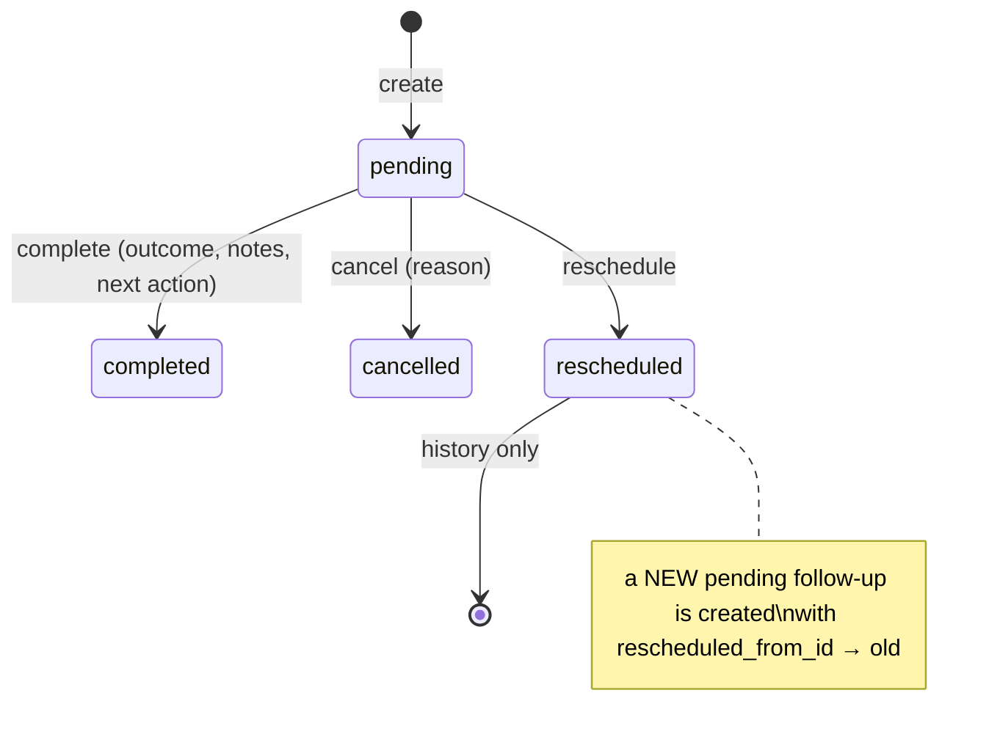
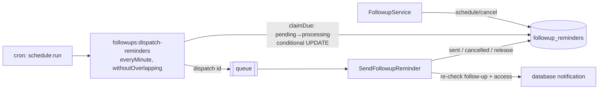

# Follow-up Module (Phase 3)

Follow-ups are scheduled sales actions (call, WhatsApp, email, demo, site visit…) on a lead, owned by one user. Meetings are a separate module (Phase 4).

## 1. Lifecycle



| Status | Meaning | Editable |
|---|---|---|
| `pending` | Open work item | yes (edit / complete / reschedule / cancel) |
| `completed` | Done; keeps outcome, notes, next action, `completed_by/at` | no |
| `cancelled` | Won't happen; keeps reason, `cancelled_by/at` | no |
| `rescheduled` | Historical record of the original time; keeps `reschedule_reason` | no |

Only `pending` records can change (`FollowupService::ensurePending`, `FollowupPolicy`). Soft delete (`followup.delete`, managers/admins) is a clean-up tool for mistakes; normal users **cancel** instead. Deleted records can be restored.

## 2. Visibility — never bypasses lead visibility

`App\Services\Followups\FollowupVisibility`:

| Tier | Permission | Follow-up rows |
|---|---|---|
| ALL | `followup.view_all` | every follow-up |
| OWN | `followup.view` | `assigned_to = me` **or** the lead is assigned to me |

There is no team tier. `followups.team_id` is deprecated: it's kept for history, no longer written, and never used for access or reports.

Every tier is **AND**-ed with `whereHas('lead', LeadVisibility::apply)`. If you cannot see the lead, you cannot see the follow-up, its notes, outcome, reminder info, or any lead data through follow-up search, notification or dashboard. Archived (soft-deleted) leads hide their follow-ups from everyone. `canView()` applies the same rules in memory for single records.

- Unknown ids → 404; ids you cannot see → 403 (audited as `FOLLOWUP_ACCESS_DENIED`); route params are numeric-only.
- OWN tier: follow-ups assigned to someone else on your own lead are listed, because you own the lead. Follow-ups assigned to you on a lead that was reassigned away become invisible to you.
- List rows (`FollowupPresenter::row`) never include completion notes; notes appear only on the detail page.

### Assignment

`assigned_to` from the client is never trusted. `FollowupVisibility::assignableUserIds()`:
- without `followup.assign` → yourself only;
- with `followup.assign` → any active user.

The assignee must also be able to see the lead. Violations return a validation error on `assigned_to` — nothing is silently changed. Default assignee: the lead owner if you may assign to them, otherwise you. `created_by`, `updated_by`, `status`, `completed_*`, `cancelled_*` are always set server-side; `team_id` is never written.

## 3. Overdue — derived, never stored

`overdue = status = pending AND scheduled_at < now()`. There is no `overdue`/`missed` status and no job that flips records. Tabs (non-overlapping, CRM timezone):

| Tab | Rule |
|---|---|
| Overdue | pending, `scheduled_at < now` |
| Today | pending, `now ≤ scheduled_at ≤ end of today` |
| Upcoming | pending, `scheduled_at > end of today` |
| Due (default) | pending, `scheduled_at ≤ end of today` (overdue + today) |
| Completed / Cancelled / All | by status |

A follow-up at exactly `now` is "today", one minute later it is "overdue". "Due soon" (`followup.due_soon_minutes`) is a UI badge only.

The Phase 1 setting `followup.mark_missed_after_minutes` conflicted with derived overdue and was **removed from `SettingDefinitions`**. Its existing DB row (if any) is left untouched and ignored.

## 4. Time handling

- DB stores UTC. Users enter date + time in the CRM timezone (`general.timezone`, default Asia/Kolkata). `CrmTime::toUtc()` converts via Carbon; `followups.timezone` records the zone used.
- Nonexistent local times (DST gap) → "Enter a valid date and time."
- Past times (before the current minute) → "Follow-ups cannot be scheduled in the past." — never silently corrected. Allowed only with `followup.schedule_past` or the `followup.allow_past` setting.
- Date filters and "today" use CRM-local midnight.

## 5. Creating

`POST /follow-ups` (`followup.create` + can see the lead). Type must be active. Priority reuses `LeadPriority` (low/medium/high/urgent) — one definition across modules. Reminder: `reminder_minutes` (0 = at time, null = none, max 7 days); omitted → `followup.default_reminder_minutes` (-1 = none).

Duplicate warning: a pending follow-up for the same lead + assignee within ±5 minutes returns error `duplicate`; resend with `confirm_duplicate=1` ("Schedule anyway").

## 6. Completing

`POST /follow-ups/{id}/complete` (`followup.complete`). One DB transaction:
1. status → completed, outcome, notes, next action, `completed_by/at`;
2. pending reminders cancelled;
3. `leads.last_contacted_at` updated if the outcome proves contact (all outcomes except *No answer*, *Busy*, *Other*) — never moved backwards;
4. timeline activity + audit;
5. optional **schedule next** (`schedule_next`, `next.*` — same validation as create, errors prefixed `next.`);
6. optional **lead status change** — only with `lead.change_status` and `can('changeStatus', lead)`, performed by `LeadService::changeStatus` (lost reason rules apply);
7. `next_followup_at` sync.

Any failure rolls everything back. The lead status is **never** changed automatically. Outcome is required unless `followup.require_outcome` is off.

## 7. Rescheduling

`POST /follow-ups/{id}/reschedule` (`followup.edit`). The original becomes `rescheduled` (keeps its time + optional reason); a new pending follow-up copies type, assignee, title, description, priority, reminder, and links `rescheduled_from_id`. Same time → error. Past time → error (unless allowed). Reminders move to the new record. The detail page shows the chain.

## 8. Cancelling

`POST /follow-ups/{id}/cancel` (`followup.cancel`). Reason required unless `followup.require_cancellation_reason` is off. Record kept; reminders cancelled.

## 9. `leads.next_followup_at` sync

`LeadFollowupSyncService::sync()` sets it to `MIN(scheduled_at)` of the lead's pending, non-deleted follow-ups (may be in the past when overdue), or `null`. Runs after create, update, complete, reschedule, cancel, delete and restore, inside the same transaction. It writes via the query builder, so `leads.updated_at` and the lead audit trail are not touched.

## 10. Reminder architecture



- One row per alert: `kind` = `reminder` (at `scheduled_at − reminder_minutes`) or `overdue` (at `scheduled_at + followup.overdue_alert_after_minutes`, 0 = off). Unique `(followup_id, kind, remind_at)`.
- If the reminder time has already passed but the follow-up is still ahead, one reminder is planned for "now" — unless one was already sent.
- **Idempotency:** `claimDue()` flips `pending → processing` with `UPDATE … WHERE id = ? AND status = 'pending'`; only the caller that changed the row dispatches it. The job acts only on `processing` rows and marks them `sent`. Two scheduler runs, or a duplicated job, deliver once.
- The job re-validates at send time: follow-up still pending and not deleted, assignee active and still able to see the follow-up/lead. Otherwise the row is `cancelled`.
- Failure: row returns to `pending` with `attempts`/`last_error` (class + message, max 500 chars) and a warning log (ids + exception class only). After `MAX_ATTEMPTS = 3` → `failed`. Queue `tries = 1`; retries are driven by the row.
- Rows stuck in `processing` for 10 minutes (crashed worker) are reclaimed.
- Completing, cancelling, rescheduling or deleting cancels pending rows; editing/restore re-plans them. Changing the overdue-alert setting affects follow-ups planned afterwards.
- The command prints nothing when nothing is due (no noisy logs).

## 11. Notifications

Laravel database notifications (`notifications` table), category `followup`:

| Event | When | Recipient |
|---|---|---|
| `followup_reminder` | reminder time | assignee |
| `followup_overdue` | overdue alert time | assignee |
| `followup_assigned` | created/reassigned by someone else | new assignee |
| `followup_rescheduled` | rescheduled by someone else | assignee |

Assigned/rescheduled are queued and dispatched **after commit** (a rolled-back action sends nothing) and never go to the actor. Payload: `category, event, message, followup_id, lead_id, url` — display hints only. `NotificationController` re-checks visibility in one batched query; items the user can no longer access show "This item is no longer available to you." with no link, and `open` redirects to the notification center. Users can only read/open their own notifications (others → 404).

UI: bell in the top bar (unread count, last 8, mark all read) and `/notifications`. WhatsApp/email/SMS delivery is **not** implemented — the "WhatsApp" type is only a label.

**Browser push:** the `followup_reminder` notification is also sent as a Web Push (`FOLLOWUP_REMINDER`, "Follow-up Reminder", "Your follow-up is due at 4:30 PM.") to users who opted in, from the same notification, so it can't be duplicated. `SendFollowupReminder` delivers under a per-reminder cache lock, so a reminder reclaimed after a stalled worker is still delivered once. Overdue alerts stay in-app only. **Known gap:** reassigning a lead doesn't move its pending follow-ups. The old assignee loses access, so the reminder is discarded at send time and nobody is reminded; reassign the follow-ups too. See [BROWSER_NOTIFICATIONS.md](BROWSER_NOTIFICATIONS.md).

## 12. Permissions

| Permission | Sales Executive | Sales Manager | Admin | Super Admin |
|---|---|---|---|---|
| `followup.view` (own) | ✔ | ✔ | ✔ | ✔ |
| `followup.view_all` | | | ✔ | ✔ |
| `followup.create` / `edit` / `complete` / `cancel` | ✔ | ✔ | ✔ | ✔ |
| `followup.assign` (to users who can see the lead) | | ✔ (own leads) | ✔ | ✔ |
| `followup.delete` (soft delete + restore) | | ✔ | ✔ | ✔ |
| `followup.schedule_past` | | | ✔ | ✔ |
| `followup.configure` (types + settings) | | | ✔ | ✔ |

No bulk completion, no export, no download.

## 13. Scheduler & queue

Production cron (every minute):

```
* * * * * cd /path/to/salescrm && php artisan schedule:run >> /dev/null 2>&1
```

Queue worker (`QUEUE_CONNECTION=database`):

```
php artisan queue:work --tries=1
```

Manual run: `php artisan followups:dispatch-reminders [--limit=200]`, then `php artisan queue:work --stop-when-empty`.

Reminders not arriving: `php artisan notifications:doctor`. It reports a missing scheduler heartbeat, due reminders nobody claimed (scheduler not running), claimed reminders nobody delivered (worker not running) and failed reminders.

## 14. Queue jobs & notifications

| Class | Purpose |
|---|---|
| `App\Console\Commands\DispatchFollowupReminders` | Claims due rows, dispatches jobs |
| `App\Jobs\SendFollowupReminder` | Re-checks and delivers one reminder |
| `App\Notifications\Followups\FollowupReminderNotification` | reminder / overdue (sent inside the job) |
| `FollowupAssignedNotification`, `FollowupRescheduledNotification` | `ShouldQueue`, `deleteWhenMissingModels` |

## 15. Admin

`/admin/followup-settings` (`followup.configure`): manage types (name, icon, color, active, order; system types and types in use cannot be deleted — deactivate them) and settings (`default_reminder_minutes`, `overdue_alert_after_minutes`, `due_soon_minutes`, `allow_past`, `require_outcome`, `require_cancellation_reason`). All changes are audited.

## 16. Audit vs activity

Audit (`module = followups`): `FOLLOWUP_CREATED`, `_UPDATED`, `_COMPLETED`, `_RESCHEDULED`, `_CANCELLED`, `_DELETED`, `_RESTORED`, `_REMINDER_SENT`, `_ACCESS_DENIED`. Completion notes are never written to audit logs. Lead timeline activities: `followup_created`, `followup_completed`, `followup_rescheduled`, `followup_cancelled` (no notes).

## 17. Tests

`tests/Feature/Followups/*` — including the release-blocking `FollowupIsolationSecurityTest` (Rahul vs Priya) and the reminder idempotency test in `FollowupReminderTest`.

## 18. Calls (Phase 6) — removed

The telephony module and its call outcome modal have been removed. Follow-ups are unaffected: they are still created, completed and reminded through the follow-up form and `FollowupService`, and the "Call" follow-up type and the `connected` / `no_answer` outcomes remain ordinary follow-up data.