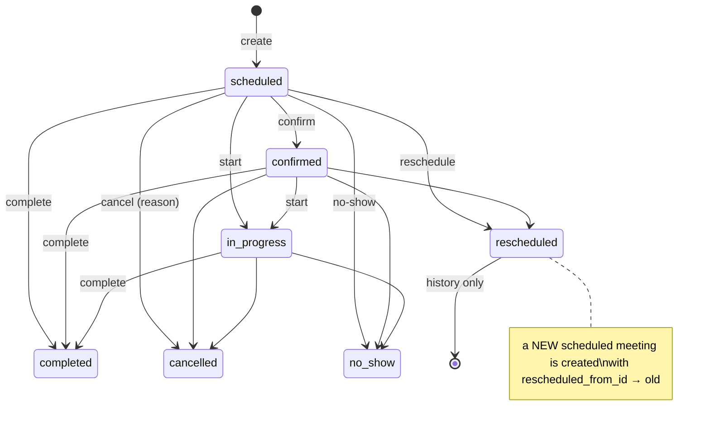

# Meeting Module (Phase 4)

Meetings and appointments with leads (demos, site visits, office meetings, video / phone calls) and internal meetings. Meetings are a dedicated module — they are **not** follow-up records — but they plug into the lead (Phase 2) and follow-up (Phase 3) workflows through those modules' services.

Code: `app/Services/Meetings/*`, `app/Policies/MeetingPolicy.php`, `app/Http/Controllers/Meetings/*`, `app/Http/Presenters/MeetingPresenter.php`, `routes/meetings.php`, `resources/js/Pages/Meetings/*`, `resources/js/Pages/Calendar/Index.vue`, `resources/js/Components/meetings/*`.

## 1. Data model

| Table | Purpose |
|---|---|
| `meeting_types` | Configurable types (Office Meeting, Client Office, Video Meeting, Google Meet, Zoom, Microsoft Teams, Phone Call, Site Visit, Product Demo, Other). `location_mode` (physical / online / phone / flexible) pre-selects the location type; `default_duration_minutes` pre-fills the end time. Used types cannot be deleted — deactivate instead. |
| `meetings` | `meeting_number` (`MTG-2026-000001`, per-year sequence), optional `lead_id`, `meeting_type_id`, `host_user_id`, `team_id` (deprecated, no longer written), `start_at`/`end_at` (UTC) + `timezone` (entry zone), location fields, `status`, `priority`, `reminder_offsets` (json, minutes before start), confirmation/start/completion/cancellation/reschedule metadata, soft deletes. |
| `meeting_participants` | `participant_type` = `user` / `lead` / `external`; `name`/`email`/`phone` snapshot taken when added; `attendance_status` (pending, confirmed, attended, absent, declined); `invitation_status` (`notified` for internal users, `not_sent` otherwise). The host is **not** stored as a participant. |
| `meeting_reminders` | One row per (reminder offset × recipient) with the shared reminder-queue state (`pending → processing → sent / cancelled / failed`, `attempts`, `claimed_at`, `sent_at`, `failed_at`, `last_error`). |

Numbering uses `NumberSequenceService` (row-locked, shared with lead numbers). The prefix comes from `meeting.number_prefix` (default `MTG`; installs that ran an earlier build may still hold `MT`). Changing the prefix affects new meetings only.

## 2. Lifecycle



| Status | Open? | Blocks calendar? | Editable |
|---|---|---|---|
| `scheduled`, `confirmed` | upcoming | yes | edit, reschedule, participants, confirm (scheduled only), start, complete, no-show, cancel |
| `in_progress` | open | yes | complete, no-show, cancel |
| `completed`, `no_show` | closed | yes (the time was used) | no |
| `cancelled`, `rescheduled` | closed | **no** | no |

- **Edit** changes descriptive fields, type, host and reminders only. The time changes only through **reschedule**; participants only through the participant endpoints on the detail page.
- Soft delete (`meeting.delete`, admins by default) is a clean-up tool; everyone else **cancels**. Restore uses the same permission and re-plans reminders.
- "Live" / "past due" are derived display states (`MeetingPresenter::state`), never stored.

## 3. Visibility — lead visibility is authoritative

`App\Services\Meetings\MeetingVisibility` is the single source of truth (SQL `apply()` and in-memory `canView()` stay in sync).

| Tier | Permission | Meetings |
|---|---|---|
| ALL | `meeting.view_all` | every meeting |
| OWN | `meeting.view` | I am the host or an internal participant, or the meeting's lead is assigned to me |

There is no team tier. `meetings.team_id` is deprecated: it's kept for history, no longer written, and never used for access or reports.

Every tier is **AND**-ed with: `lead_id IS NULL OR the lead is visible to me through LeadVisibility (and not archived)`. Consequences:

- Being added as a participant never grants access to someone else's lead. A participant who cannot see the lead cannot see the meeting (and is never offered as a participant for it).
- If a lead is reassigned, meetings on it disappear for users who lose the lead — including the host.
- Unknown ids → 404; ids you cannot see → 403, audited as `MEETING_ACCESS_DENIED`. Route params are numeric-only.
- All list, search, calendar, dashboard, Lead 360, participant-search and notification queries filter in SQL. Nothing is fetched and filtered in JavaScript.

**Manage vs view.** `canManage()` (edit, reschedule, cancel, complete, participants): OWN → host only; ALL → any — always plus lead visibility. Participants who are not the host may view and RSVP only.

## 4. Hosts and participants

`MeetingParticipantService`:

- **Host** — without `meeting.assign` you host your own meetings. With it → any active user. The host must be able to see the lead. Default host on a lead: the lead owner when you may assign to them, otherwise you. Violations are validation errors on `host_user_id` — nothing is silently changed.
- **Internal participants** — any active user (`invitableUserIds`, for anyone with a meeting tier) who can also see the lead. Search results are filtered on the server, so users who can't see the lead are never offered. Errors on `participant_user_ids.N` (create) or `user_id` (add).
- **Lead participant** — snapshots the lead's current name / email / phone.
- **External participants** — name + optional email / phone; stored for the record, never contacted in Phase 4.
- Autocomplete: `GET /meetings/participants/search?q=&lead_id=` returns at most 20 invitable active users; an invisible `lead_id` returns 404.
- RSVP: an internal participant may confirm or decline their own attendance (`POST /meetings/{id}/respond`). Declined participants are not busy and get no reminders.

## 5. Conflict detection

`MeetingConflictService::find($start, $end, $userIds, $exclude)`:

```sql
status NOT IN ('cancelled','rescheduled')
AND start_at < :new_end AND end_at > :new_start          -- touching edges do not overlap
AND (host_user_id IN (:users)
     OR EXISTS (participant: type = user AND user_id IN (:users) AND attendance_status <> 'declined'))
AND id NOT IN (:exclude)                                  -- the meeting being rescheduled / edited
```

- Checked for the host and every internal participant on create, reschedule, host change and participant add. All instants are UTC, so meetings entered in different timezones compare correctly.
- Result → validation errors `conflicts.0…N`. Users with `meeting.override_conflict` also get `conflict_override` and may resubmit with `override_conflict = true`; the override is audited (`MEETING_CONFLICT_OVERRIDDEN`, conflicting meeting ids only). Others cannot bypass by sending the flag.
- Switch off with setting `meeting.conflict_checking`.

### Conflict privacy

`MeetingConflictService::message()` reveals details only when the actor can view the conflicting meeting:

- Visible: *"Rahul Sharma already has another meeting from 3:00 PM to 4:00 PM on Sep 25 (MTG-2026-000012: Product demo)."*
- Not visible: *"Rahul Sharma is unavailable during the selected time."* — no title, time, lead, notes or other participants.

## 6. Calendar

`/calendar` (FullCalendar 6): Month, Week, Day and Agenda (list) views with a current-time indicator; Agenda by default on phones.

- Events load from `GET /calendar/events?start&end[&scope=mine&host&type&hide_cancelled]` — visible meetings overlapping the window, max 62 days and 1000 events, `rescheduled` history excluded, filters applied in SQL.
- The calendar runs in UTC-coercion mode: the feed sends CRM-timezone wall-clock times without an offset (`2026-09-25T10:00:00`), and the range parameters are interpreted in the CRM timezone. Rendering, "now" and drag results are therefore always in the CRM timezone regardless of the browser zone.
- Colour = meeting type colour; cancelled / no-show events are muted.
- Click event → meeting page. Click / select an empty slot → schedule modal pre-filled (if `can.create`).
- Drag / resize → the reschedule modal pre-filled with the new time (only on events the viewer may reschedule — `editable` comes from the policy). Confirming runs the normal reschedule workflow (conflicts, history, reminders, notifications); closing it reverts the event.

## 7. Rescheduling

`MeetingService::reschedule()` (upcoming meetings only):

1. Validates the new time (valid, end after start, ≤ 24 h, not in the past without permission, different from the current time) and conflicts for all attendees, excluding the meeting itself.
2. Marks the original `rescheduled` (+ `reschedule_reason`) and cancels its pending reminders.
3. Creates a new `scheduled` meeting with `rescheduled_from_id`, a new number, the same lead / type / host / details, a copy of the participants (attendance reset, declines kept) and freshly planned reminders.
4. Lead activity "Rescheduled the Product Demo from … to …", audit `MEETING_RESCHEDULED`, notification to attendees (not the actor).

## 8. Cancellation and no-show

- **Cancel** — open meetings; reason required unless `meeting.require_cancellation_reason` is off. Records `cancelled_at/by`, cancels reminders, lead activity, audit, notifies attendees.
- **No-show** — open meetings; outcome `no_show`, optional notes, marks selected participants `absent`. Never changes the lead status and does not count as contact.

## 9. Completion

`MeetingCompletionService::complete()` — one transaction; any failure rolls everything back:

1. Outcome (required unless `meeting.require_outcome` is off) and notes (required unless `meeting.require_notes_on_complete` is off).
2. Participant attendance (`attended` / `absent`).
3. Cancels pending reminders; outcomes other than no-show / other mark the lead contacted (`LeadFollowupSyncService::markContacted`).
4. Lead activity "Product Demo completed. Outcome: Interested", audit `MEETING_COMPLETED`.
5. **Optional next follow-up** — created through `FollowupService::create()` (Phase 3), never directly from the meeting controller. It needs `can('create', [Followup, lead])`; all Phase 3 rules apply (assignee scope, past-time check, duplicates, reminders, `next_followup_at`, follow-up activity + audit). Errors come back as `followup.*`.
6. **Optional lead status change** — through `LeadService::changeStatus()` (Phase 2). Needs `lead.change_status` and `can('changeStatus', lead)`; Lost requires a lost reason. The outcome alone never changes the lead status.
7. Notifies attendees (not the actor) after commit.

## 10. Lead and dashboard integration

- **Lead 360 → Meetings tab**: visible meetings on the lead (max 100, newest first) grouped Upcoming / Past / Completed / Cancelled, row actions from policy flags, and **Schedule meeting** (host defaults to the lead owner when allowed). The Quick actions panel has a Meeting button.
- **Dashboard**: My / Company meetings (per visibility tier) — today, upcoming, completed today, the next meeting and today's list with quick actions.
- Lead activities: `meeting_created`, `meeting_confirmed`, `meeting_rescheduled`, `meeting_cancelled`, `meeting_completed`, `meeting_no_show`.

## 11. Reminders

- Offsets per meeting from `MeetingReminderOptions` (at start, 15 min, 30 min, 1 h, 2 h, 1 day); default from `meeting.default_reminder_minutes` (or none).
- `MeetingReminderService::schedule()` plans one row per offset × attendee (host + internal participants who have not declined), re-planning whenever the meeting, host, reminders or attendees change: obsolete pending rows are cancelled, cancelled rows for the same time are revived, duplicates are impossible (unique `meeting_id, user_id, channel, remind_at`). If a window has already passed but the meeting is still ahead, one catch-up reminder is sent now — unless an earlier reminder already covered it.
- Complete, cancel, no-show, start, reschedule (old meeting) and delete cancel pending rows.
- `meetings:dispatch-reminders` (every minute, `withoutOverlapping`) claims due rows through the shared `App\Services\Reminders\ReminderQueue` — an atomic conditional `UPDATE … SET status='processing'`, so overlapping runs or double-queued jobs can never deliver twice — and dispatches `SendMeetingReminder` per row. Rows stuck in `processing` for 10 minutes are reclaimed.
- The job re-checks at send time: row still `processing`, meeting upcoming and not deleted, started less than 5 minutes ago, recipient still attending, active and able to view the meeting. Otherwise the row is cancelled. Delivery failures release the row for retry, and after 3 attempts it becomes `failed` (`failed_at`, `last_error`). Sent reminders are audited (`MEETING_REMINDER_SENT`).
- Message: *"Product Demo with Amit Desai starts in 30 minutes."* In-app (database channel) only.
- The scheduler is silent when there is nothing to do (no polling logs).

## 12. Notifications

In-app, after commit, never to the actor, only to active users who can still view the meeting: assigned as host, invited, rescheduled, cancelled, completed, reminders. The stored payload is a display hint — `NotificationController` re-checks visibility and masks stale items ("This item is no longer available to you."). External participants and leads are not contacted.

## 13. Permissions

| Permission | Sales Executive | Sales Manager | Admin | Super Admin |
|---|---|---|---|---|
| `meeting.view` (own) | ✓ | ✓ | ✓ | ✓ |
| `meeting.view_all` | | | ✓ | ✓ |
| `meeting.create` | ✓ | ✓ | ✓ | ✓ |
| `meeting.edit` (edit, reschedule, confirm, participants) | ✓ | ✓ | ✓ | ✓ |
| `meeting.cancel` | ✓ | ✓ | ✓ | ✓ |
| `meeting.complete` (start, complete, no-show) | ✓ | ✓ | ✓ | ✓ |
| `meeting.delete` (soft delete, restore) | | | ✓ | ✓ |
| `meeting.assign` (host = someone else) | | ✓ | ✓ | ✓ |
| `meeting.create_without_lead` | | ✓ | ✓ | ✓ |
| `meeting.override_conflict` | | ✓ | ✓ | ✓ |
| `meeting.schedule_past` | | | ✓ | ✓ |
| `meeting.configure` (Meeting Settings) | | | ✓ | ✓ |

The spec's `meeting.reschedule` and `meeting.restore` are intentionally not separate permissions: rescheduling is covered by `meeting.edit` and restore by `meeting.delete`, so no near-duplicate permission names exist.

Route middleware is the first gate; `MeetingPolicy` re-checks tier + manage rights + lead visibility per record. Policy ability names contain no dots, so the Super Admin `Gate::before` bypass does not skip record checks.

## 14. Settings (Admin → Meeting Settings)

`meeting.number_prefix`, `meeting.default_duration_minutes`, `meeting.default_reminder_minutes`, `meeting.require_notes_on_complete`, `meeting.require_outcome`, `meeting.require_cancellation_reason`, `meeting.allow_past`, `meeting.conflict_checking`. The default timezone is the global `general.timezone`. Changes are audited through `SettingService`.

## 15. Scheduler and queues

| Command | Schedule | Notes |
|---|---|---|
| `meetings:dispatch-reminders` | every minute, `withoutOverlapping(5)` | claims ≤ 200 due rows, queues `SendMeetingReminder` |

Production needs `php artisan schedule:run` every minute (cron / Task Scheduler) and a queue worker (`php artisan queue:work`) for reminder jobs and `MeetingActivityNotification`.

## 16. Out of scope (Phase 4)

No meeting export, no `.ics` download, no automatic Zoom / Google Meet / Teams link creation (only a URL the user pastes), no external calendar sync, no email / WhatsApp to participants, no Facebook Lead Ads (Phase 5).

## 17. Calls (Phase 6) — removed

The telephony module and its call outcome modal have been removed. Meetings are unaffected: they are still scheduled through the meeting form and `MeetingService` with the same permissions, conflict detection and reminders. The "Phone Call" meeting type is ordinary meeting data.